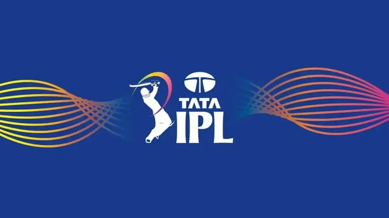
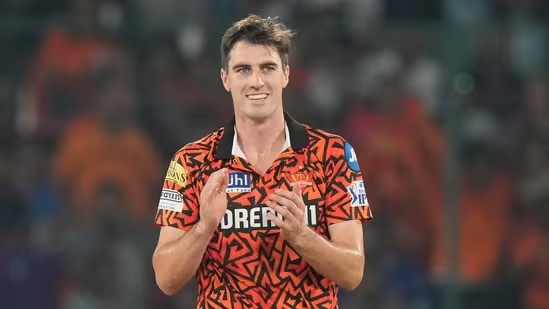
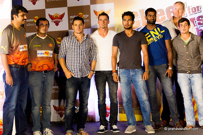

# How did Sunrisers Hyderabad reach from bottom to top in Indian Premier League(IPL) 2024? {.tabset}

Bhavya Bhargava   

An Enthusiast's Perspective

Dated: 2024-08-31

<!-- ---------------------------------------------------------------------- -->
<!-- Data Details - Task 1 Tab -->
<!-- ---------------------------------------------------------------------- -->

## Data Details

My whole analysis is based around the question:

### What were the reasons for Sunrisers Hyderabad, a recently bottom-feeding team to suddenly rise up to the Top in the internationally acclaimed Indian Premier League(IPL) this year?

The data for this analysis was obtained by web scrapping from various sources and the description for each is as below:

#### Copyright and Accreditation:

Starting off, The player’s name and role data is web scrapped from crictracker.com who in their copyright notice they have stated that the data can be copied or extracted from their website by third parties for their personal and non-commercial use [1]. They themselves state in their DMCA policy, that the data held by them is considered available in public domain and is accredited wherever they reference it [2].
As there were some data inconsistencies in the data from crictracker.com, some wrangling had to be manually done which was done by referencing iplt20.com, IPL’s official data resource.

Coming to the performance data of the teams, it was web-scrapped from statisticstimes.com which in its terms of use policy states that anyone can use the data present on the site and that it is not responsible for any inaccuracies or accuracies of the data [3].
Statisticstimes.com itself captures the data from IPL T 20 official website and as per their media creation terms and conditions no data should be used for commercial usage [4]. As we are not utilising this data for non commercial purposes it was deemed OK to use it.

#### Purpose for Data Usage:

Analyzing team performance differences: By examining the structure of the team over the seasons, Analysing their performance over the latest season and looking at the performance gap over the seasons we can understand the rise in the team's performance and justify the changes which have been made to the team since the previous seasons.

#### Metadata:

1.	Player:
Description – Name of the player part of SRH for that season.
Datatype – Character/String.

2.	Role:
Description - Role of the player part of SRH for that season.
Datatype – Character/String.

3.	Team:
Description – Initials of the team playing in 2024 season.
Datatype – Character/String.

4.	Win: 
Description - Number of matches won by the team in 2024 season.
Datatype – Numeric (Double).

5.	Lose:
Description - Number of matches lost by the team in 2024 season.
Datatype – Numeric (Double).

6.	No Result:
Description - Number of matches the team got no result in 2024 season due to unforeseen circumstances.
Datatype – Numeric (Double).

7.	Result:
Description - Outcome for the team in the 2024 season.
Datatype – Character/String.

8.	Value:
Description - Number of matches of that particular outcome for that team in 2024 season.
Datatype – Numeric (Double).

9.	Year:
Description - Year season in which SRH played the IPL.
Datatype – Numeric (Double).

10.	Run Rate:
Description – The net run rate of SRH over the 2024 season. It is a performance indicator based on the average runs that were scored for the team minus the average scored against them.
Datatype – Numeric (Double).


#### Data Acquisition:

For gathering the player’s name and role data I have scrapped multiple pages of crictracker.com which is the fastest-growing website in India for everything cricket and is run by a few cricket fans [5][6][7].
```{r echo = TRUE, message = FALSE, warning = FALSE}
# Importing the libraries utilized
library(tidyverse)

# Importing the library for data scraping (keeping redundant packages)
library(rvest)
library(httr)

# Function to scrape player data
extract_srh_players <- function(url, year) {
  # Read the webpage content
  page <- read_html(url)
  
  # Finding the heading node that contains the desired table
  if (year == 2022) {
    heading_text <- paste0("Sunrisers Hyderabad (SRH) Team ", year, " players list:")
    heading_node <- page %>% 
      html_nodes(xpath = paste0("//h3[contains(text(), '", heading_text, "')]"))
  } else if (year == 2023) {
    heading_text <- paste0("Sunrisers Hyderabad (SRH) Team ", year, " players list:")
    heading_node <- page %>% 
      html_nodes(xpath = paste0("//h3[b[contains(text(), '", heading_text, "')]]"))
  } else if (year == 2024) {
    heading_text <- "Sunrisers Hyderabad (SRH)"
    heading_node <- page %>% 
      html_nodes(xpath = paste0("//h3[google-sheets-html-origin[contains(text(), '", heading_text, "')]]"))
  } else {
    stop("Unsupported year: ", year)
  }
  
  if (length(heading_node) == 0) {
    stop("Heading not found for year: ", year)
  }
  
  # Finding the table node following the heading node
  table_node <- heading_node %>% 
    html_nodes(xpath = "following-sibling::div//table") %>% 
    html_node("tbody")
  
  if (length(table_node) == 0) {
    stop("Table not found for year: ", year)
  }
  
  # Extracting the table data
  table_data <- table_node %>%
    html_table(header = TRUE)
  
  if (year == 2023) {
    # For 2023, the first row contains the header, and we need to remove the "Price" column
    table_data <- table_data[[1]] %>%
      slice(-1) %>%  
      rename(Player = 1, Role = 2) %>%  
      select(Player, Role)
  } else if (year == 2024) {
    if (length(table_data) == 0 || length(table_data[[1]]) < 2) {
      stop("Table extraction failed or table has less than 2 columns for year: ", year)
    }
    
    table_data <- table_data[[1]] %>%
      rename(Player = 1, Role = 2) %>%  
      select(Player, Role)  
  } else {
    if (length(table_data) == 0 || length(table_data[[1]]) < 2) {
      stop("Table extraction failed or table has less than 2 columns for year: ", year)
    }
    
    table_data <- table_data[[1]] %>%
      select(Player, Role)
  }
  
  return(table_data)
}

# URLs of the pages containing the tables
url_2022 <- "https://www.crictracker.com/srh-players-list-2022-complete-sunrisers-hyderabad-squad-and-players-list-for-ipl-2022/"
url_2023 <- "https://www.crictracker.com/cricket-news/srh-team-2023-player-list-complete-sunrisers-hyderabad-srh-squad-and-players-list-for-ipl-2023/"
url_2024 <- "https://www.crictracker.com/cricket-news/srh-team-2024-player-list-complete-sunrisers-hyderabad-srh-squad-and-players-list-for-ipl-2024/"

# Extracting the players data for 2022, 2023, and 2024 and storing
players_2022 <- extract_srh_players(url_2022, 2022)
players_2023 <- extract_srh_players(url_2023, 2023)
players_2024 <- extract_srh_players(url_2024, 2024)

```

Here the function reads the webpage content using the rvest package and locates the heading node that contains the player list for the respective year. Based on the year, it adjusts the XPath query to find the correct heading and table. It then extracts the player data from the table, processes it to remove unnecessary columns and rows, and returns the cleaned data frame. The script then uses this function to scrape the player data from three specific URLs for 2022, 2023, and 2024, storing the results in players_2022, players_2023, and players_2024 data frames, respectively.

#### Additional Data-Wrangling to fix the player data inaccuracies

After checking against the official data source on iplt20.com it was found that there were some inaccuracies and inconsistencies in the player’s name and role information [8]. Below is the code to fix it and make it usable for visualizations.
```{r echo = TRUE, message = FALSE, warning = FALSE}
# Individual data entries modified to reflect the official data at iplt20.com

# Modifying roles in players_2022 data frame
players_2022 <- players_2022 %>%
  mutate(Role = case_when(
    Player == "Glenn Phillips" ~ "Batter",
    Player == "Vishnu Vinod" ~ "Wicket-Keeper",
    Role == "All-Rounder" ~ "All-rounder",
    Role == "Batsman" ~ "Batter",
    TRUE ~ Role
  ))

# Modifying roles in players_2023 data frame
players_2023 <- players_2023 %>%
  mutate(
    Player = str_replace(Player, "\\s*\\([^\\)]+\\)", ""),
    Role = case_when(
    Player == "Glenn Phillips" ~ "Batter",
    Role == "Wicket-keeper" ~ "Wicket-Keeper",
    Role == "All-Rounder" ~ "All-rounder",
    TRUE ~ Role
  ))

# Valid Roles of the Players listed
valid_roles <- c("All-rounder", "Batter", "Bowler", "Wicket-Keeper")

# Modifying roles in players_2024 data frame
players_2024 <- players_2024 %>%
  mutate(Player = str_replace(Player, "\\s*\\([^\\)]+\\)", "")) %>%
  filter(Role %in% valid_roles) 

```

#### Capturing SRH and other Teams performance data.

For grabbing the performance data for the teams in IPL 2024 and the Performance data for SRH in the couple of previous seasons I scrapped the data from a page on statisticstimes.com which is a famous data source for finding any up-to-date detailed data related to India [9].
```{r echo = TRUE, message = FALSE, warning = FALSE}
# Function for extracting IPL points table from the page
extract_ipl_points_table <- function(url) {
  # Reading the webpage content
  page <- read_html(url)
  
  # Finding the table node that contains the caption "IPL 2024 Points Table"
  table_node <- page %>%
    html_nodes(xpath = "//caption[contains(text(), 'IPL 2024 Points Table')]/parent::table")
  
  # Extracting headers from thead
  headers <- table_node %>%
    html_node("thead") %>%
    html_nodes("th") %>%
    html_text(trim = TRUE)
  
  # Extracting data from tbody
  data <- table_node %>%
    html_node("tbody") %>%
    html_nodes("tr") %>%
    html_nodes("td") %>%
    html_text(trim = TRUE)
  
  # Reshaping the data into a data frame
  data_matrix <- matrix(data, ncol = length(headers), byrow = TRUE)
  table_data <- as.data.frame(data_matrix, stringsAsFactors = FALSE)
  colnames(table_data) <- headers
  
  # Adjusting the column names based on the inspection
  table_data <- table_data %>%
    select(`Team`, `W`, `L`, `N/R`) %>%
    rename(Win = W, Lose = L, `No result` = `N/R`) %>%
    mutate(
      Team = str_extract(Team, "^[^\\(]+") %>% str_trim(),
      Win = as.numeric(Win),
      Lose = as.numeric(Lose) * -1,# Making Lose values negative
      `No result` = as.numeric(`No result`)
    )
  
  return(table_data)
}

# URL of the page containing the table
url <- "https://statisticstimes.com/sports/ipl/all-ipl-points-table.php"

# Extracting the IPL 2024 Points Table data
points_table_2024 <- extract_ipl_points_table(url)

```

Here the function reads the webpage content using the rvest package, locates the table containing the caption "IPL 2024 Points Table" using an XPath query, and extracts the headers and data from the table. The data is then reshaped into a data frame, and specific columns (Team, W, L, N/R) are selected and renamed to Win, Lose, and No result. The Lose values are made negative, and all numerical values are converted to numeric types. The cleaned data frame is returned. The script then uses this function to extract the points table data from the given URL, storing the result in the points_table_2024 data frame.

#### Preparing data for visualizations

As I am planning to present the data for the teams in the form of a stacked bar chart, it needs to be converted into long-form to make it easy to plot. 
```{r echo = TRUE, message = FALSE, warning = FALSE}
# Transforming the data into long format
points_table_long <- points_table_2024 %>%
  pivot_longer(cols = c(Win, Lose, `No result`), 
               names_to = "Result", 
               values_to = "Value") %>%
  arrange(factor(Team, levels = unique(Team)))

```

#### Capturing SRH performance data over 3 seasons

Data was captured from the same page as all teams performance data on statisticstimes.com and is processed for ease of understanding [9].
```{r echo = TRUE, message = FALSE, warning = FALSE}
extract_net_rr <- function(url, year) {
  # Read the webpage content
  page <- read_html(url)
  
  # Find the table node that contains the caption with the respective year
  table_node <- page %>%
    html_nodes(xpath = paste0("//caption[contains(text(), 'IPL ", year, " Points Table')]/parent::table"))
  
  if (length(table_node) == 0) {
    stop("Table not found with caption 'IPL ", year, " Points Table'")
  }
  
  # Extract headers from thead
  headers <- table_node %>%
    html_node("thead") %>%
    html_nodes("th") %>%
    html_text(trim = TRUE)
  
  # Extract data from tbody
  data <- table_node %>%
    html_node("tbody") %>%
    html_nodes("tr") %>%
    map(~ html_nodes(.x, "td") %>% html_text(trim = TRUE)) %>%
    map(~ set_names(.x, headers)) %>%
    bind_rows()
  
  # Find the Net RR for SRH
  net_rr <- data %>%
    filter(str_detect(Team, "SRH|Sunrisers Hyderabad")) %>%
    pull(`Net RR`)
  
  # Return the year and Net RR as a data frame
  return(data.frame(Year = year, `Run Rate` = net_rr, stringsAsFactors = FALSE))
}

# URL of the page containing the points tables
url_points <- "https://statisticstimes.com/sports/ipl/all-ipl-points-table.php"

# Extracting the Net RR for SRH for 2022 and 2023
net_rr_2022 <- extract_net_rr(url_points, 2022)
net_rr_2023 <- extract_net_rr(url_points, 2023)
net_rr_2024 <- extract_net_rr(url_points, 2024)

# Combine the data frames
net_rr_combined <- bind_rows(net_rr_2022, net_rr_2023, net_rr_2024) %>%
  rename_with(~ gsub("[.]", " ", .)) %>%
  mutate(`Run Rate` = as.numeric(gsub("[^0-9.-]", "", `Run Rate`)))

```

Here the above function reads the webpage content using the rvest package, locates the table using an XPath query, and extracts headers and data. It reshapes the data into a data frame, filters for SRH's Net RR, and returns a data frame with the year and Net RR. The script then uses this function to get the Net RR for SRH for 2022, 2023, and 2024, combines the results, and ensures the Run Rate column values are numeric. The final data frame net_rr_combined is displayed, showing the Net RR for SRH across the specified years.

### References

[1]  CricTracker. (n.d.). Copyright Notice. CricTracker. https://www.crictracker.com/copyright-notice/

[2] CricTracker. (n.d.-b). DMCA. CricTracker. https://www.crictracker.com/dmca/

[3] Terms of use - StatisticsTimes.com. (n.d.). https://statisticstimes.com/termsofuse.php

[4] Indian Premier League Official Website. (n.d.). https://www.iplt20.com/about/media-accreditation-terms--conditions?id=10&page=1

[5] Nair, K. (2022, April 2). SRH Players List 2022: Complete Sunrisers Hyderabad squad and players list for IPL 2022. CricTracker. https://www.crictracker.com/srh-players-list-2022-complete-sunrisers-hyderabad-squad-and-players-list-for-ipl-2022/

[6] Staff, C. (2023, December 19). SRH Team 2023 Player List: Complete Sunrisers Hyderabad (SRH) squad and players list for IPL 2023. CricTracker. https://www.crictracker.com/cricket-news/srh-team-2023-player-list-complete-sunrisers-hyderabad-srh-squad-and-players-list-for-ipl-2023/

[7] S, A. P. (2024, January 3). SRH Team 2024 Player LIST: Complete Sunrisers Hyderabad (SRH) squad and players list for IPL 2024. CricTracker. https://www.crictracker.com/cricket-news/srh-team-2024-player-list-complete-sunrisers-hyderabad-srh-squad-and-players-list-for-ipl-2024/

[8] SunRisers Hyderabad | IPL 2024 Team analysis and players. (n.d.). https://www.iplt20.com/teams/sunrisers-hyderabad

[9] IPL points Table (2008-2024) - StatisticsTimes.com. (n.d.). https://statisticstimes.com/sports/ipl/all-ipl-points-table.php


<!-- ---------------------------------------------------------------------- -->
<!-- Blog post - Task 2 Tab -->
<!-- ---------------------------------------------------------------------- -->

## Blog post 

### What is the Indian Premier League(IPL)?




The Indian Premier League (IPL) is a professional Twenty20 (T20) cricket league, considered one of the most exciting and influential tournaments in the sport. It features eight city-based franchises competing in a high-octane format with star players from around the world.  The IPL's global significance lies in its fast-paced action, glamorous presentation, and innovative strategies, attracting a massive fan following worldwide. It has revolutionized cricket, inspiring similar leagues globally and propelling T20 cricket to new heights.

### Who are Sunrisers Hyderabad(SRH)?


Sunrisers Hyderabad (SRH), a franchise cricket team based in Hyderabad, India. They compete in the Indian Premier League (IPL), the most popular cricket tournament in the world.  SRH is a significant team in cricket circles for a few reasons. They've won the IPL championship once and consistently challenge for the title. They're known for their passionate fan base and for attracting talented players through strategic acquisitions. With their orange and black jerseys, SRH is a recognizable and respected force in the IPL.

### Why analyse SRH?

Sunrisers Hyderabad (SRH) is a great example of a team that used to struggle but is now doing much better.  For a few years, they were always near the bottom of the league. But lately, they've gotten a lot stronger and are even fighting for the championship!

This turnaround is interesting because SRH was always seen as a newer team compared to others with more experience and wins. They were kind of the underdog. But things changed when they made Pat Cummins their captain. He was always famous but rose to glory with his captaincy of the World Tournament winning Australian national cricket team, and thus they offered him one of the highest offer in the IPL auction history! It was a risky move, but it seems to have worked out well.

Looking at how SRH went from the bottom to the top is a good way to learn how teams can improve. Maybe it was Cummins' leadership, maybe they found the right players, or maybe they just did something different.  Whatever it was, it's a great story for any cricket fan!

### Where to get IPL and SRH data?

The original data for the players, SRH and Teams was acquired from various sources including the official IPL T20 website [1], StatisticsTimes.com [2] and crictracker.com [3] which was later processed internally to be of use to analysis. The data is as follows:

*Here is the players data over 3 seasons used for analysis*
```{r echo = FALSE, message = FALSE, warning = FALSE, results= 'asis'}
# Library for displaying the data as a HTML element post-knitting
library(knitr)
library(kableExtra)

# Arrange data frames by Role
players_2022 <- players_2022 %>% arrange(Role) %>% drop_na()
players_2023 <- players_2023 %>% arrange(Role) %>% drop_na()
players_2024 <- players_2024 %>% arrange(Role) %>% drop_na()

# Create HTML tables with titles and add styles
t1 <- kable(players_2022, format='html', table.attr = "border=1", caption = "2022 SRH Lineup") %>%
  kable_styling(full_width = FALSE, position = "left", bootstrap_options = c("striped", "hover"))
t2 <- kable(players_2023, format='html', table.attr = "border=1", caption = "2023 SRH Lineup") %>%
  kable_styling(full_width = FALSE, position = "left", bootstrap_options = c("striped", "hover"))
t3 <- kable(players_2024, format='html', table.attr = "border=1", caption = "2024 SRH Lineup") %>%
  kable_styling(full_width = FALSE, position = "left", bootstrap_options = c("striped", "hover"))

# Combine the tables into a single HTML output
html_output <- paste0(
  '<style>
     table { font-family: Arial, sans-serif; border-collapse: collapse; width: 100%; }
     th, td { border: 1px solid #dddddd; text-align: left; padding: 8px; }
     th { background-color: #f2f2f2; }
     tr:nth-child(even) { background-color: #f9f9f9; }
     .table-container { display: flex; justify-content: space-between; }
   </style>',
  '<div class="table-container">',
  '<div>', t1, '</div>',
  '<div>', t2, '</div>',
  '<div>', t3, '</div>',
  '</div>'
)

# Display the combined HTML
cat(html_output, sep = '')

```

*Below is the Performance data for SRH and all the other Teams*
```{r echo = FALSE, message = FALSE, warning = FALSE, results= 'asis'}
# Create HTML tables with titles and add styles
t1 <- kable(points_table_2024, format='html', table.attr = "border=1", caption = "2024 Teams Performance") %>%
  kable_styling(full_width = FALSE, position = "left", bootstrap_options = c("striped", "hover"))
t2 <- kable(net_rr_combined, format='html', table.attr = "border=1", caption = "SRH Run Rate") %>%
  kable_styling(full_width = FALSE, position = "left", bootstrap_options = c("striped", "hover"))

# Combine the tables into a single HTML output
html_output <- paste0(
  '<style>
     table { font-family: Arial, sans-serif; border-collapse: collapse; width: 100%; }
     th, td { border: 1px solid #dddddd; text-align: left; padding: 8px; }
     th { background-color: #f2f2f2; }
     tr:nth-child(even) { background-color: #f9f9f9; }
     .table-container { display: flex; justify-content: space-between; }
   </style>',
  '<div class="table-container">',
  '<div>', t1, '</div>',
  '<div>', t2, '</div>',
  '</div>'
)

# Display the combined HTML
cat(html_output, sep = '')
```


### What does the data say about SRH perfromance?

#### Improved Performance as comapred to previous seasons

From the visualization below it can be observed that there is a sudden spike in the performance of the team in 2024 from the continuous decline of the previous two seasons.

```{r echo = FALSE, message = FALSE, warning = FALSE}
library(ggplot2)

# Plotting the combined net rr data
ggplot(net_rr_combined, aes(x = Year, y = `Run Rate`)) +
  geom_line(color = "blue", size = 1.2) +
  geom_point(color = "red", size = 3) +
  geom_hline(yintercept = 0, color = "black", size = 0.5, linetype = "dashed") +
  geom_text(aes(label = round(`Run Rate`, 3)), vjust = -1, hjust = 0.75, color = "black", size = 3) +
  scale_x_continuous(breaks = net_rr_combined$Year) +
  labs(title = "SRH Run Rate over 3 Seasons",
       x = "Year",
       y = "Run Rate") +
  theme_minimal(base_size = 10) +
  theme(plot.title = element_text(hjust = 0.5, face = "bold"),
        axis.title = element_text(face = "bold"),
        axis.text = element_text(face = "bold"))

```

It can be seen that SRH's run rate in 2022 and 2023 was negative, with values of -0.379 and -0.590, respectively. These figures indicate consistent underperformance across these seasons, possibly due to a lack of effective team strategies, poor form of key players, or inadequate team coordination. 

These negative run rates further suggest that SRH struggled to score efficiently while conceding more runs to their opponents, leading to a lower success rate in matches.

But this sudden upward trend suggests a strong rebound and an overall better performance in the 2024 season. 

#### Exceptional gains as compared to competition

The strong rebound can be further seen in the visualization below that SRH not only just performed really well but also gave the winners a run for their money with their exceptional performance throughout the season.

```{r echo = FALSE, message = FALSE, warning = FALSE}
# Necessary libraries for a presentable visualization
library(viridis)

# Setting the max value for the Y-axis
max_y_value <- points_table_long %>% 
  filter(Result %in% c("Win", "No result")) %>%
  group_by(Team) %>%
  summarise(Total = sum(Value)) %>%
  pull(Total) %>%
  max()

# Plotting the 2024 all teams performance data
ggplot(points_table_long, aes(x = Team, y = Value, fill = Result)) +
  geom_bar(stat = "identity", position = "stack") +
  scale_fill_viridis(discrete = TRUE, name = "Result") +
  scale_y_continuous(breaks = seq(min(points_table_long$Value), max_y_value, by = 1)) +
  theme_minimal(base_size = 10) +
  ylab("Results") +
  xlab("Teams") +
  ggtitle("IPL 2024 All Teams Performance") +
  theme(plot.title = element_text(hjust = 0.5, face = "bold"),
        axis.title = element_text(face = "bold"),
        axis.text = element_text(face = "bold"))

```

Here it can be seen that SRH not only beats the whole pack in terms of wins (except KKR(Kolkata Knight Riders) who won the tournament by a subtle margin and RR(Rajasthan Royals) whom they beat in the Qualifiers) but also kept the number of losses to the minimum which we concluded earlier was opposite of the way they performed in the previous seasons.

Suddenly what changed for Sunrisers between the last two seasons for such a performance??

### Reasons for this sudden jump in SRH performance

The reasons for this improvement can be attributed to many factors which helped to boost the performance drastically. The factors being:

#### Restructuring of the Team:

```{r echo = FALSE, message = FALSE, warning = FALSE}

# Adding a Year column to each data frame
players_2022 <- players_2022 %>% mutate(Year = "2022")
players_2023 <- players_2023 %>% mutate(Year = "2023")
players_2024 <- players_2024 %>% mutate(Year = "2024") 

# Combine the data frames
all_players <- bind_rows(players_2022, players_2023, players_2024)

# Count the number of players for each role by year
player_counts <- all_players %>%
  group_by(Year, Role) %>%
  summarise(Count = n()) %>%
  ungroup()

# Plotting the Players data
ggplot(player_counts, aes(x = Year, y = Count, fill = Role)) +
  geom_bar(stat = "identity", position = "dodge") +
  scale_fill_viridis(discrete = TRUE, name = "Role") +
  scale_y_continuous(breaks = seq(0, 12, by = 1), limits = c(0, 12)) +
  theme_minimal(base_size = 10) +
  ylab("SRH Lineup per year") +
  xlab("Year") +
  ggtitle("SRH Players Distribution by Role Over Years") +
  theme(plot.title = element_text(hjust = 0.5, face = "bold"),
        axis.title = element_text(face = "bold"),
        axis.text = element_text(face = "bold"))

```

Here we can observe the 2024 team structure, with a higher number of all-rounders and a balanced batting lineup, provided SRH with the versatility and depth needed to adapt to various match situations effectively. This strategic shift from the 2022 and 2023 structures likely contributed to their improved performance, making them the first runners-up in 2024. The consistent bowling attack ensured stability, while the specialized wicket-keeper maintained efficiency in fielding. This combination of factors justifies the 2024 team structure as a significant improvement over the previous years.

#### Change in the leadership of the team:




The leadership change in SRH significantly impacted their performance in the 2024 IPL season. Pat Cummins, the Australian World Cup-winning captain, was appointed as the new skipper, marking the fourth captaincy change in three years [4]. Under Cummins' leadership, SRH's strategy and team dynamics improved, leading them to become the first runners-up. This change brought a fresh perspective and stability, which were crucial after their disappointing performances in the previous seasons under different captains.

Pat Cummins' leadership was marked by strategic planning, adaptability, and effective team management. His approach emphasized aggressive play and data-driven decisions, resulting in SRH frequently posting high scores, including several 200-plus totals and a record 287 against RCB. Cummins' ability to adapt during matches was exemplified in the qualifier against RR, where he effectively utilized spinners on a spin-friendly pitch, despite SRH lacking specialist spinners in their initial lineup [5].

Moreover, Cummins' close working relationship with the new coach, who shared a similar mindset, allowed them to implement innovative strategies and give players the freedom to express themselves. This cohesive leadership and willingness to experiment were crucial in SRH's journey to becoming the first runners-up in IPL 2024 [6]. 

#### Gamble on new key players paid off:




SRH's gamble on new key players also paid off significantly in the 2024 season. The inclusion of impactful players like Mayank Agarwal, Glenn Phillips, and Travis Head bolstered the batting lineup, providing the team with the ability to set and chase substantial targets. The presence of versatile all-rounders such as Washington Sundar and Shahbaz Ahmed offered flexibility in both batting and bowling departments, enabling the team to adapt to various match situations [7].

Moreover, the experienced bowling lineup, featuring Bhuvneshwar Kumar and the rising star T Natarajan, was crucial in restricting opponents and taking vital wickets. The combination of seasoned players and fresh talent created a balanced team capable of performing under pressure. This strategic selection and utilization of players were instrumental in SRH's successful campaign, ultimately helping them reach the finals and secure the runner-up position [8].

### What can other teams learn from SRH?

Below are a few key learnings other teams whether they be Bottom-feeders or Top of the class can take to improve there chances of better performance in the coming seasons:

*Data-Driven Decisions-*

Cummins' captaincy was marked by a data-driven approach, emphasizing analytics to inform strategies. This resulted in SRH frequently posting high scores, including record-breaking totals. Other teams can invest in data analysis and empower their captains to leverage insights for better decision-making [9].

*Strategic Talent Acquisition-*

SRH's success highlights the importance of strategic talent acquisition. Their targeted selection of players like Agarwal, Phillips, and Head filled specific gaps in their batting lineup, addressing weaknesses identified through data analysis or scouting. Other teams can emulate this approach by using data and scouting reports to target players who complement their existing team structure [10].

*Auction Budget Management-*

SRH's effective use of their IPL auction budget is another key takeaway. By focusing on acquiring impactful players like Mayank Agarwal and versatile all-rounders like Washington Sundar and Shahbaz Ahmed, they achieved a balanced team composition without overspending. Other teams can learn to prioritize needs, identify value picks, and avoid bidding wars to optimize their auction strategy [11].

By adopting these learnings, particularly the emphasis on data, strategic acquisitions, and auction budget management, both current bottom feeders and top teams can significantly improve their IPL performance. Bottom feeders can gain a roadmap for rebuilding, while top teams can identify areas to refine their strategies and maintain a competitive edge.

### References

[1] SunRisers Hyderabad | IPL 2024 Team analysis and players. (n.d.-b). https://www.iplt20.com/teams/sunrisers-hyderabad/squad/2024#list

[2] StatisticsTimes.com | Collection of Statistics and charts. (n.d.). https://statisticstimes.com/index.php

[3] CricTracker. (n.d.-b). Cricket live score, cricket news, predictions, stats | CricTracker. CricTracker. https://www.crictracker.com/

[4] Federal, Federal, & Federal. (2024, March 4). The federal. The Federal. https://thefederal.com/cricket/ipl-2024-srh-make-another-captaincy-change-fourth-in-3-years-112473?infinitescroll=1

[5] myKhel.com. (2024, May 29). IPL 2024: How Pat Cummins proved his captaincy mettle during SRH vs RR IPL 2024 Qualifier 2 in Chennai? https://twitter.com/mykhelcom/status/1794902253062754527

[6] Chaphekar, V. (2024, May 25). SRH’s comeback success credited to Pat Cummins’ captaincy and leadership. Crictoday. https://crictoday.com/cricket/news/srhs-comeback-success-credited-to-pat-cummins-captaincy-and-leadership/

[7] IT News Desk. (2024, May 26). Which Team Has Higher Probability Of Lifting IPL 2024 Trophy? Key Details About KKR vs SRH Clash. IndiaTimes. https://www.indiatimes.com/news/sports/all-you-need-to-know-about-kkr-vs-srh-ipl-2024-final-match-prediction-key-players-reserve-day-for-rain-head-to-head-records-expected-playing-xi-when-and-where-to-watchvenue-635048.html

[8] Desk, H. S. (2023, December 19). Sunrisers Hyderabad full squad after IPL 2024 auction: SRH splurge for Cummins. Hindustan Times. https://www.hindustantimes.com/cricket/sunrisers-hyderabad-full-squad-after-ipl-2024-auction-srh-break-the-bank-for-cummins-101702978553580.html

[9] Republic Sports Desk & Republic World Digital. (2024, May 25). SRH coach reveals how captain Pat Cummins used data analytics before every game in IPL 2024. Republic World. https://www.republicworld.com/sports/cricket/ipl/srh-coach-reveals-how-pat-cummins-used-data-analytics-to-win-games-in-ipl-2024/?amp=1

[10] Ritam. (2023, December 12). Coetzee To Join Markram, Klaasen & Jansen? Here’s SRH Squad Analysis & Auction Strategy. OneCricket. https://cricket.one/cricket-analysis/coetzee-to-join-markram-klaasen-jansen-heres-srh-squad-analysis-auction-strategy/6577e420de38a068f4cd56cd

[11] Singh, M. (2024, April 26). IPL Auction Strategies: Insights into Talent Evaluation and Team Building in the League. https://www.linkedin.com/pulse/ipl-auction-strategies-insights-talent-evaluation-team-mukesh-singh-kuphc/

Tools used For Data Acquisition:

[12] Wickham, H. (2020). rvest: R package for harvesting web content [Computer software]. Available from https://cran.r-project.org/package=rvest

[13] R Core Team. (2024). httr: An R package for HTTP communication [Computer software]. R Foundation for Statistical Computing. https://cran.r-project.org/package=httr

[14] Wickham, H., Averick, M., Bryan, J., Chang, W., McGowan, L., François, R., Grolemund, G., Hayes, A., Henry, L., Hester, J., Kuhn, M., Pedersen, T., Miller, E., Bache, S., Müller, K., Ooms, J., Robinson, D., Seidel, D., Spinu, V., . . . Yutani, H. (2019). Welcome to the Tidyverse. Journal of Open Source Software, 4(43), 1686. https://doi.org/10.21105/joss.01686


<!-- ---------------------------------------------------------------------- -->
<!-- Behind the Scenes - Task 3 Tab -->
<!-- ---------------------------------------------------------------------- -->

## Behind the Scenes

#### Catching Data in the Wild

The study of the Sunrisers Hyderabad (SRH) cricket team was hard in many ways, and careful steps had to be taken to make sure the data was correct. One big job was to get information about players from the team's website. This meant changing code for each of the three years (2022, 2023, and 2024) because the website was being updated regularly. This step was important, but it wasn't very interesting.

Once all the information was gathered, it was carefully checked against the official website for the Indian Premier League (IPL). In this step, mistakes like misspelt player names and wrong job assignments were found and fixed for each year's data. This method was necessary to keep the quality and reliability of the data, even though it was time-consuming. Along with that, data transformation was needed to get the data ready for visualisations. For example, the points table data had to be rearranged in order to make a stacked bar chart. Here each row showed the team, the outcome (win, loss, or no result), and the value that went with it. This process wasn't very pretty, but it was necessary for the final presentation.

It is important to remember that the risk of website changes continuously persists, leaving the existing data gathering code ineffective. Thus, continuous monitoring and code updates may be necessary to maintain the accuracy of data collection. Moving to the analysis process, it brings to light the important but often ignored work that goes on behind the scenes of data analysis. The end charts and insights get a lot of attention, but the careful steps of data preparation, validation, and transformation are just as important for making sure the results are reliable and correct. Even though they aren't very exciting, these steps are very important to the general quality and reliability of the analysis.

#### Challenges of Analysis

During my analysis of the Sunrisers Hyderabad (SRH) cricket team, I did face some unexpected challenges that I had not expected initially. One issue was the need to clean up and standardize the player names. When scraping data from the website, I found player names were written differently, with variations in capitalization, abbreviations, and the order of first and last names. This required me to write extra code functions to make all the names consistent across the dataset, which was an added task I didn't foresee.

Another surprise was dealing with special cases related to player roles and statistics. Sometimes, a player's main role was different from the role recorded for a specific match. I had to add more instructions to my code to properly categorize players based on the actual roles they played, rather than relying only on the listed roles. At first, my plan was to only analyze SRH's performance metrics and trends. However, as I progressed, I realized it was important to compare their performance with other teams in the league to provide better context. This led me to expand the scope of the project to include gathering and visualizing data for all teams' performances, which required more data processing and transformation work than I had initially planned for.

Additionally, I didn't expect there to be differences between the data on SRH's website and the official IPL website. This meant I had to cross-check and verify the data from multiple sources, which was while being time-consuming, necessary to ensure accuracy and reliability.

While the core coding tasks like handling dates or doing calculations weren't too difficult, the unexpected need for cleaning up names, dealing with special cases, expanding the scope, and reconciling data from different sources added complexity and extra effort to the analysis.

#### Further Scope of Improvement

While the analysis conducted provided me with some valuable insights, I feel there are still some areas for improvement. 

1. The data collection process from web scraping could be made more efficient and reliable. Perhaps using RSelenium could be the way to get the data from dynamic websites. 

2. The data cleaning and transformation steps could be further automated to reduce the manual work. 

3. Expanding the scope to include more in-depth analysis of specific aspects of the like per match run rate, player performances in different situations and venues, and  local vs international training metrics could help in getting additional insights. 

4. Additionally, incorporating data from future IPL seasons would keep the analysis relevant and help us in getting long-term trends.
